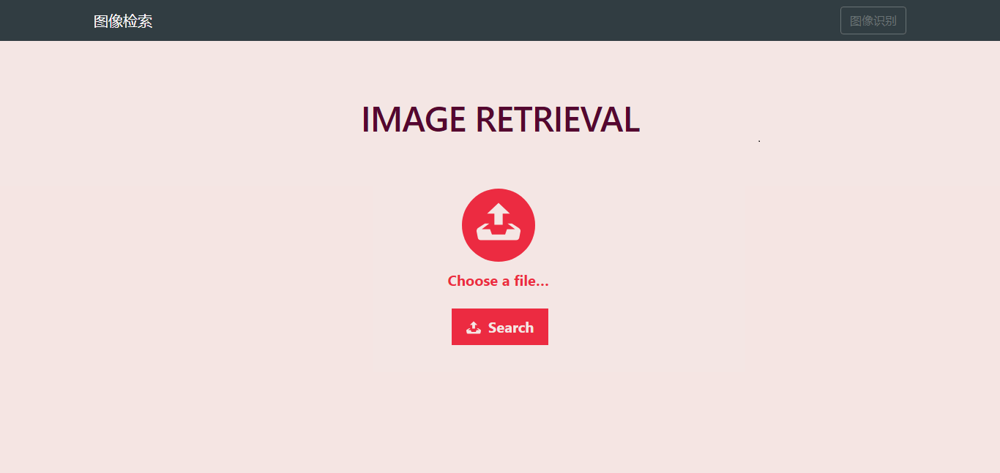

# 图像检索系统(分类加检索)
`使用部分deepfashion-inshop的数据`[data](http://mmlab.ie.cuhk.edu.hk/projects/DeepFashion/InShopRetrieval.html)

[website](https://cgpeter96.github.io/simple-image-retrieval-system/)

## 使用库python3
```
Flask                              0.12.2
Flask-Bootstrap                    3.3.7.1
Flask-Cors                         3.0.2
Flask-Dropzone                     1.4.3
Flask-Script                       2.0.6
Flask-Uploads                      0.2.1
Flask-WTF                          0.14.2
gevent                             1.2.1
Keras                              2.0.6
numpy                              1.13.1
scipy                              0.19.1
```

##使用步骤

### 训练
> 针对检索数据训练一个分类器，选用分类器
```
数据目录结构(需要将数据目录结构弄成这样)
image_new/
    |--MEN-Denim/
    |--MEN-Jackets_Vests/
    |--MEN-Pants/
    |--MEN-Shirts_Polos/
    .
    .
    .
```
`keras_vgg.py`是分类器程序


### 正式使用
1. 在model文件中放入模型文件
2. 先使用`python retrieval.py`对要检索的图片提取特征
3. 执行主程序`python main.py`


---



---
附上网盘地址，缺什么就来这里找，看不看的懂就不管了，哈哈哈。[想不想要剧毒的代码，小眼睛看过来](https://pan.baidu.com/s/1SLceVG1-KrOIIG6t3AhsJw)

## 参考
[flask-keras-cnn-image-retrieval](https://github.com/willard-yuan/flask-keras-cnn-image-retrieval)
